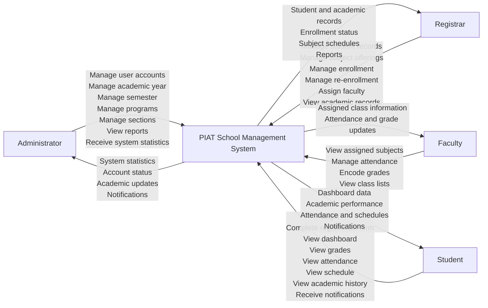

# 1. Context Diagram (Level 0)

## Purpose

This context diagram provides a high-level view of the PIAT School Management System and its interaction with the main external users of the system.

## System Boundary

The system boundary encloses the complete web-based school management platform used by PIAT for student administration, enrollment, academic tracking, and reporting.

## Interpretation

- The system is the single central process that receives and processes requests from four major user groups.
- The flows shown represent the major functions of the PIAT School Management System in a concise academic context diagram.
- The diagram intentionally excludes internal data processing details and focuses only on external interaction.
