# 2. Data Flow Diagram (DFD)

## Purpose

This Level 1 Data Flow Diagram shows how data moves between external entities, main system processes, and data stores in the PIAT School Management System.

## Notation

- External entities are shown as rectangles.
- Processes are shown as rounded rectangles.
- Data stores are shown as parallel lines.

```mermaid
flowchart TD
    Admin[Administrator]
    Registrar[Registrar]
    Faculty[Faculty]
    Student[Student]

    P1([1. User Authentication])
    P2([2. Student Registration])
    P3([3. Enrollment])
    P4([4. Re-enrollment])
    P5([5. Subject Offering Management])
    P6([6. Faculty Assignment])
    P7([7. Attendance Management])
    P8([8. Grade Management])
    P9([9. Student Dashboard])
    P10([10. Faculty Dashboard])
    P11([11. Registrar Dashboard])
    P12([12. Administrator Dashboard])
    P13([13. Academic Records])
    P14([14. Notifications])
    P15([15. Reports])

    D1[(Users)]
    D2[(Students)]
    D3[(Faculty)]
    D4[(Programs)]
    D5[(Subject Offerings)]
    D6[(Subjects)]
    D7[(Enrollments)]
    D8[(Attendance)]
    D9[(Grades)]
    D10[(Academic Records)]
    D11[(Notifications)]
    D12[(Academic Years)]
    D13[(Semesters)]
    D14[(Sections)]

    Admin -->|Login credentials / role requests| P1
    Student -->|Login credentials / profile requests| P1
    Registrar -->|Authentication requests| P1
    Faculty -->|Authentication requests| P1

    P1 -->|Authentication result / role / token| Admin
    P1 -->|Authentication result / role / token| Registrar
    P1 -->|Authentication result / role / token| Faculty
    P1 -->|Authentication result / role / token| Student
    P1 -->|User identity| D1

    Student -->|Registration form data| P2
    P2 -->|Student profile and status| D2
    P2 -->|Program and academic structure data| D4
    P2 -->|Academic year / semester / section values| D12
    P2 -->|Academic year / semester / section values| D13
    P2 -->|Academic year / semester / section values| D14
    P2 -->|Registration confirmation| Student

    Registrar -->|Enrollment request| P3
    Student -->|Enrollment selection| P3
    P3 -->|Enrollment transaction| D7
    P3 -->|Subject offerings| D5
    P3 -->|Subject details| D6
    P3 -->|Enrollment status| Registrar
    P3 -->|Enrollment status| Student

    Registrar -->|Re-enrollment request| P4
    Student -->|Re-enrollment request| P4
    P4 -->|Updated enrollment record| D7
    P4 -->|Academic history and prior records| D10
    P4 -->|Re-enrollment confirmation| Registrar
    P4 -->|Re-enrollment confirmation| Student

    Registrar -->|Offering details| P5
    Admin -->|Program and schedule updates| P5
    P5 -->|Subject offering records| D5
    P5 -->|Subject catalog| D6
    P5 -->|Academic year / semester data| D12
    P5 -->|Academic year / semester data| D13

    Registrar -->|Faculty assignment data| P6
    P6 -->|Assigned faculty information| D3
    P6 -->|Updated offering assignment| D5
    P6 -->|Updated offering assignment| D6

    Faculty -->|Attendance records| P7
    Student -->|Attendance view request| P7
    P7 -->|Attendance transactions| D8
    P7 -->|Attendance summary| Faculty
    P7 -->|Attendance summary| Student

    Faculty -->|Grade entries| P8
    Student -->|Grade inquiry| P8
    P8 -->|Grade records| D9
    P8 -->|Grade summary| Faculty
    P8 -->|Grade summary| Student

    Student -->|Dashboard request| P9
    P9 -->|Dashboard data| D2
    P9 -->|Dashboard data| D7
    P9 -->|Dashboard data| D9
    P9 -->|Dashboard data| D8
    P9 -->|Dashboard data| D11
    P9 -->|Dashboard view| Student

    Faculty -->|Dashboard request| P10
    P10 -->|Class list and assigned subject data| D5
    P10 -->|Faculty performance data| D8
    P10 -->|Faculty performance data| D9
    P10 -->|Dashboard view| Faculty

    Registrar -->|Dashboard request| P11
    P11 -->|Student and enrollment metrics| D2
    P11 -->|Student and enrollment metrics| D7
    P11 -->|Student and enrollment metrics| D10
    P11 -->|Dashboard view| Registrar

    Admin -->|Dashboard request| P12
    P12 -->|User, program, and system metrics| D1
    P12 -->|User, program, and system metrics| D4
    P12 -->|Dashboard view| Admin

    P13 -->|Academic record data| D10
    P13 -->|Academic record data| D2
    P13 -->|Academic record data| D7
    P13 -->|Academic record data| D9
    P13 -->|Academic record data| D8
    P13 -->|Academic history| Student
    P13 -->|Academic history| Registrar

    P14 -->|Notifications and alerts| D11
    P14 -->|Notifications and alerts| Student
    P14 -->|Notifications and alerts| Faculty
    P14 -->|Notifications and alerts| Registrar
    P14 -->|Notifications and alerts| Admin

    P15 -->|Summary reports| D2
    P15 -->|Summary reports| D7
    P15 -->|Summary reports| D9
    P15 -->|Summary reports| D8
    P15 -->|Reports| Admin
    P15 -->|Reports| Registrar
```

## Notes

- The current SQLite-backed implementation does not use dedicated tables for academic years, semesters, and sections; these are represented as metadata and text fields in the existing schema.
- The DFD captures the main functional modules implemented in the projects’ backend routes and frontend dashboards.
