# 3. Entity Relationship Diagram (ERD)

## Purpose

This ERD models the relational structure of the PIAT School Management System based on the actual SQLite schema implemented in the backend.

## ERD Overview

```mermaid
erDiagram
    PROGRAMS ||--o{ CURRICULUM : contains
    PROGRAMS ||--o{ SUBJECTS : offers
    STUDENTS ||--o{ ENROLLMENTS : has
    SUBJECTS ||--o{ ENROLLMENTS : receives
    STUDENTS ||--o{ GRADES : receives
    SUBJECTS ||--o{ GRADES : contains
    STUDENTS ||--o{ ATTENDANCE : has
    SUBJECTS ||--o{ ATTENDANCE : has
    USERS ||--o{ NOTIFICATIONS : receives
    STUDENTS ||--o{ ACADEMIC_RECORDS : has
    SUBJECTS ||--o{ ACADEMIC_RECORDS : contributes_to

    PROGRAMS {
        TEXT id PK
        TEXT name
        TEXT description
        TEXT status
        TEXT createdAt
    }

    CURRICULUM {
        TEXT id PK
        TEXT programId FK
        TEXT yearLevel
        TEXT semester
        TEXT subjectCode
        TEXT subjectTitle
        INTEGER units
    }

    USERS {
        TEXT id PK
        TEXT userId UK
        TEXT username UK
        TEXT email
        TEXT password
        TEXT firstName
        TEXT lastName
        TEXT middleName
        TEXT studentId FK
        TEXT role
        TEXT status
        TEXT program
        TEXT yearLevel
        TEXT semester
        TEXT academicYear
        TEXT createdAt
        TEXT temporaryPassword
        TEXT firstLoginAt
        TEXT lastLoginAt
    }

    STUDENTS {
        TEXT id PK
        TEXT studentId UK
        TEXT firstName
        TEXT lastName
        TEXT middleName
        TEXT suffix
        TEXT email UK
        TEXT password
        TEXT gender
        TEXT dob
        INTEGER age
        TEXT civilStatus
        TEXT nationality
        TEXT religion
        TEXT educationLevel
        TEXT program
        TEXT yearLevel
        TEXT gradeLevel
        TEXT strand
        TEXT studentType
        TEXT academicYear
        TEXT semester
        TEXT section
        TEXT previousSchool
        TEXT lastGrade
        TEXT contactNumber
        TEXT address
        TEXT city
        TEXT province
        TEXT zip
        TEXT fatherName
        TEXT fatherOccupation
        TEXT fatherContact
        TEXT motherName
        TEXT motherOccupation
        TEXT motherContact
        TEXT guardianName
        TEXT guardianOccupation
        TEXT guardianContact
        TEXT guardianRelation
        TEXT parentName
        TEXT parentContact
        TEXT parentAddress
        TEXT emergencyName
        TEXT emergencyContact
        TEXT emergencyAddress
        TEXT emergencyRelation
        TEXT placeOfBirth
        TEXT barangay
        TEXT parentRelationship
        TEXT status
        TEXT submittedAt
        TEXT reviewedAt
        TEXT reviewNote
        TEXT firstLoginAt
        TEXT lastLoginAt
    }

    SUBJECTS {
        TEXT id PK
        TEXT code
        TEXT title
        INTEGER units
        TEXT schedule
        TEXT room
        TEXT instructor
        TEXT program
        TEXT yearLevel
        TEXT semester
        TEXT facultyId FK
        TEXT academicYear
        INTEGER addedAt
    }

    ENROLLMENTS {
        TEXT id PK
        TEXT studentId FK
        TEXT subjectId FK
        TEXT academicYear
        TEXT semester
        TEXT enrolledAt
        TEXT status
    }

    GRADES {
        TEXT id PK
        TEXT studentId FK
        TEXT subjectId FK
        REAL grade
        TEXT remarks
        TEXT period
        TEXT type
        TEXT component
        TEXT status
        INTEGER submittedAt
    }

    ATTENDANCE {
        TEXT id PK
        TEXT studentId FK
        TEXT subjectId FK
        TEXT date
        TEXT status
        INTEGER updatedAt
    }

    NOTIFICATIONS {
        TEXT id PK
        TEXT userId FK
        TEXT type
        TEXT title
        TEXT message
        INTEGER read
        INTEGER createdAt
        TEXT relatedId
    }

    ACADEMIC_RECORDS {
        TEXT id PK
        TEXT studentId FK
        TEXT subjectId FK
        TEXT academicYear
        TEXT semester
        TEXT recordType
        TEXT summary
        TEXT createdAt
    }
```

## Relationship Notes

- One program can have many curriculum entries.
- One student can have many enrollments, grades, attendance records, and academic records.
- One subject can be associated with many enrollments, grades, attendance records, and academic records.
- One user can receive many notifications.
- The implementation uses SQLite-friendly text-based identifiers and does not currently define a separate faculty table; faculty-related data is represented through the users table and subject assignments.
