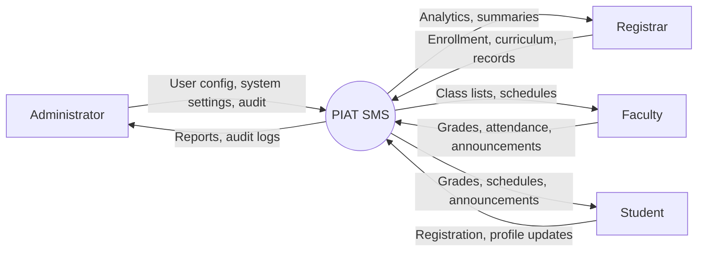

# PIAT School Management System
## System Diagrams

---

## Table of Contents

1. [Context Diagram (DFD Level 0)](#1-context-diagram-level-0)
2. [Data Flow Diagram (DFD Level 1)](#2-data-flow-diagram-dfd-level-1)
3. [Entity Relationship Diagram (ERD)](#3-entity-relationship-diagram-erd)

---

## 1. Context Diagram (Level 0)

The Context Diagram (also known as Level 0 DFD) presents the highest-level view of the PIAT School Management System as a single process interacting with its external environment.

### External Entities

- **Administrator** — Manages system configuration, user accounts, audit logs, and overall system administration.
- **Registrar** — Handles student enrollment, academic records, curriculum management, and transcript generation.
- **Faculty** — Manages grade entry, attendance tracking, class schedules, and course announcements.
- **Student** — Self-registers, requests enrollment, views grades/schedules/attendance, and receives announcements.

### System: PIAT School Management System
A web-based academic operations platform (React frontend + Express REST API + SQLite database) that serves the complete student lifecycle.



### Data Flow Descriptions

| Source | Destination | Data Flow | Description |
|--------|-------------|-----------|-------------|
| Administrator | PIAT SMS | System config, user management | Admin submits user accounts, system settings, and role changes |
| Registrar | PIAT SMS | Enrollment data, curriculum updates | Registrar enters enrollment records, curriculum items, and record requests |
| Faculty | PIAT SMS | Grades, attendance, announcements | Faculty submits grade entries, attendance, and announcements |
| Student | PIAT SMS | Application data, requests | Students submit registration data and profile updates |
| PIAT SMS | Administrator | Reports, audit logs | System sends usage reports, activity logs, alerts |
| PIAT SMS | Registrar | Analytics, summaries, transcripts | System provides enrollment analytics and generated documents |
| PIAT SMS | Faculty | Class lists, schedules | System provides faculty's assigned classes and student rosters |
| PIAT SMS | Student | Grades, schedules, attendance, announcements | System delivers academic records, schedules, and communications to students |

---

## 2. Data Flow Diagram (DFD Level 1)

DFD Level 1 decomposes the single PIAT SMS process into major sub-processes. It shows how data enters, is transformed, stored, and exits the system.

### External Entities
- **Administrator**
- **Registrar**
- **Faculty**
- **Student**

### Major Processes
- **P1 — Authentication & User Management** (Admin, Registrar, Faculty, Student)
- **P2 — Student Registration & Re-enrollment** (Registrar, Student)
- **P3 — Enrollment Management** (Registrar)
- **P4 — Grade Management & Finalization** (Faculty, Registrar)
- **P5 — Attendance Tracking** (Faculty)
- **P6 — Academic Structure Configuration** (Registrar, Admin)
- **P7 — Reports & Analytics** (Admin, Registrar, Faculty, Student)
- **P8 — Notifications & Announcements** (Admin, Faculty)
- **P9 — System Audit & Settings** (Admin)

### Data Stores
- **D1 — STUDENT_RECORDS** (students, enrollments, academic_records)
- **D2 — GRADE_RECORDS** (grades)
- **D3 — ATTENDANCE_RECORDS** (attendance)
- **D4 — ACADEMIC_STRUCTURE** (programs, academic_years, semesters, sections, curriculum, subject_offerings)
- **D5 — USER_ACCOUNTS** (users, faculty)
- **D6 — COMMUNICATIONS** (notifications, announcements)
- **D7 — AUDIT_TRAIL** (activity_logs, settings)

```mermaid
flowchart TD
    %% External Entities
    ADM[Administrator]
    REG[Registrar]
    FAC[Faculty]
    STU[Student]

    %% Processes
    P1((P1\nAuthentication\n& User Mgmt))
    P2((P2\nStudent Registration\n& Re-enrollment))
    P3((P3\nEnrollment\nManagement))
    P4((P4\nGrade Management\n& Finalization))
    P5((P5\nAttendance\nTracking))
    P6((P6\nAcademic Structure\nConfiguration))
    P7((P7\nReports\n& Analytics))
    P8((P8\nNotifications\n& Announcements))
    P9((P9\nSystem Audit\n& Settings))

    %% Data Stores
    D1[(STUDENT\nRECORDS)]
    D2[(GRADE\nRECORDS)]
    D3[(ATTENDANCE\nRECORDS)]
    D4[(ACADEMIC\nSTRUCTURE)]
    D5[(USER\nACCOUNTS)]
    D6[(COMMUNICATIONS)]
    D7[(AUDIT\nTRAIL)]

    %% External Entity → Process
    ADM -->|"Login credentials"| P1
    ADM -->|"Role config\nSettings update"| P6
    ADM -->|"Report requests"| P7
    ADM -->|"Announcement creation"| P8
    ADM -->|"Settings update"| P9

    REG -->|"Login credentials"| P1
    REG -->|"Registration review\nEnrollment actions"| P2
    REG -->|"Re-enrollment actions"| P3
    REG -->|"Grade finalization"| P4
    REG -->|"Report requests"| P7
    REG -->|"Curriculum setup\nSection config"| P6

    FAC -->|"Login credentials"| P1
    FAC -->|"Grade entries"| P4
    FAC -->|"Attendance records"| P5
    FAC -->|"Announcement creation"| P8
    FAC -->|"Class reports\nPerformance queries"| P7

    STU -->|"Login credentials"| P1
    STU -->|"Registration form"| P2
    STU -->|"Re-enrollment request"| P2
    STU -->|"Record requests"| P7

    %% Process ↔ Data Store
    P1 <-->|"Validate credentials\nManage profiles\nToken issuance"| D5
    P1 -->|"Login audit entries"| D7

    P2 <-->|"Student personal data\nRegistration forms\nRe-enrollment triggers"| D1
    P2 -->|"User account updates\nStudent records"| D5
    P2 -->|"Migration history\nApproval logs"| D7

    P3 <-->|"Student enrollment\nSubject assignments"| D1
    P3 <-->|"Subject offering\nSection availability"| D4
    P3 <-->|"Grade completion check"| D2
    P3 -->|"Enrollment event log"| D7
    P3 -->|"Enrollment confirmation"| D6

    P4 <-->|"Grade entries\nGrade finalization"| D2
    P4 <-->|"Student/Subject lookup"| D1
    P4 <-->|"Offering/Schedule lookup"| D4
    P4 -->|"Grade event log"| D7

    P5 <-->|"Attendance records\nBulk updates"| D3
    P5 <-->|"Student lookup\nOffering lookup"| D1
    P5 <-->|"Academic context"| D4
    P5 -->|"Attendance event log"| D7
    P5 -->|"Real-time SSE push"| FAC
    P5 -->|"Real-time SSE push"| STU

    P6 <-->|"Academic years\nPrograms\nSections\nCurriculum"| D4
    P6 -->|"Structure change logs"| D7

    P7 <-->|"Query: students\nQuery: grades\nQuery: attendance\nQuery: enrollment\nQuery: structure\nQuery: users\nQuery: notifications"| D1
    P7 <-->|"Query: grades"| D2
    P7 <-->|"Query: attendance"| D3
    P7 <-->|"Query: structure\nQuery: offerings"| D4
    P7 <-->|"Query: users/faculty"| D5
    P7 <-->|"Query: notifications\nQuery: announcements"| D6

    P8 <-->|"Notifications\nAnnouncements"| D6
    P9 <-->|"System settings"| D7

    %% Data Store → External Entity
    P7 -->|"Enrollment reports\nTranscripts\nCurricula summaries\nFaculty load reports\nStudent lists\nDashboard analytics"| REG
    P7 -->|"Report exports\nPerformance analytics"| ADM
    P7 -->|"Grade reports\nClass performance\nAttendance summaries"| FAC
    P7 -->|"Grade reports\nAttendance reports\nSchedule updates\nAnnouncements"| STU
```



### Process Descriptions

**P1 — Authentication & User Management**
- Validates login credentials against stored user accounts
- Issues JWT bearer tokens with role-based access
- Handles password changes (scrypt hashing)
- Manages first-login and temporary password flows
- Enforces role-based access control (admin, faculty, registrar, student)

**P2 — Student Registration & Re-enrollment**
- Processes student self-registration forms
- Reviews registration (Registrar approve/reject)
- Creates student user accounts on approval
- Sends registration status notifications
- Handles re-enrollment for returning students

**P3 — Enrollment Management**
- Creates, updates, and drops student enrollments
- Validates eligibility based on grades and requirements
- Assigns students to subject offerings and sections
- Manages enrollment workflow states

**P4 — Grade Management & Finalization**
- Records grade entries with period/type/component breakdown
- Manages grade status workflow: `draft → submitted → finalized`
- Computes overall grades from component grades
- Locks finalized grades against further modification

**P5 — Attendance Tracking**
- Marks individual or bulk attendance records per class/section
- Prevents duplicate entries via `UNIQUE(studentId, subjectId, date)`
- Triggers real-time SSE events for live attendance updates
- Supports statuses: present, absent, late, excused

**P6 — Academic Structure Configuration**
- Manages academic years, semesters, and program definitions
- Creates sections with student capacity
- Defines curriculum subjects by program and year level
- Creates subject offerings that link subjects to sections

**P7 — Reports & Analytics**
- Generates enrollment, faculty load, and student reports
- Produces curricula summaries and transcript-like records
- Supplies data for registrar and admin dashboards

**P8 — Notifications & Announcements**
- Creates and broadcasts announcements by category and audience
- Generates per-user notifications for system events
- Supports pinned announcements and announcement expiry

**P9 — System Audit & Settings**
- Logs all significant user actions to `activity_logs`
- Reads and updates key-value system settings
- Provides audit log querying and export for admins

---

## 3. Entity Relationship Diagram (ERD)

The ERD shows the logical data model of the PIAT SMS database. **All 18 tables** are displayed with their primary keys, columns, and relationship cardinalities.

### Legend
- **PK** — Primary Key
- **FK** — Foreign Key
- **UK** — Unique Key
- **[PK]** inside column list means primary key
- **[FK:table.column]** means foreign key reference

### ERD Diagram

```mermaid
erDiagram
    users {
        string id PK "UUID"
        string userId UK "NOT NULL"
        string username UK "NOT NULL"
        string email "NOT NULL"
        string password "NOT NULL"
        string firstName "NOT NULL"
        string lastName "NOT NULL"
        string middleName
        string studentId
        string role "NOT NULL"
        string status "NOT NULL"
        string createdAt "NOT NULL"
    }

    faculty {
        string id PK "UUID"
        string userId FK-u "UNIQUE, NOT NULL"
        string employeeId UK
        string firstName "NOT NULL"
        string lastName "NOT NULL"
        string middleName
        string email UK "NOT NULL"
        string department
        string designation
        string status "NOT NULL"
        string createdAt "NOT NULL"
    }

    students {
        string id PK "UUID"
        string studentId UK "NOT NULL"
        string firstName "NOT NULL"
        string lastName "NOT NULL"
        string middleName
        string suffix
        string email UK "NOT NULL"
        string password "NOT NULL"
        string gender
        string dob
        int age
        string civilStatus
        string nationality
        string religion
        string educationLevel "NOT NULL"
        string program
        string yearLevel
        string gradeLevel
        string strand
        string studentType
        string academicYear
        string semester
        string section
        string previousSchool
        string lastGrade
        string contactNumber
        string address
        string city
        string province
        string zip
        string fatherName
        string fatherOccupation
        string fatherContact
        string motherName
        string motherOccupation
        string motherContact
        string guardianName
        string guardianOccupation
        string guardianContact
        string guardianRelation
        string parentName
        string parentContact
        string parentAddress
        string emergencyName
        string emergencyContact
        string emergencyAddress
        string emergencyRelation
        string placeOfBirth
        string barangay
        string parentRelationship
        string status "NOT NULL"
        string submittedAt "NOT NULL"
        string reviewedAt
        string reviewNote
        string firstLoginAt
        string lastLoginAt
    }

    programs {
        string id PK "UUID"
        string name UK "NOT NULL"
        string description
        string status "NOT NULL"
        string createdAt "NOT NULL"
    }

    academic_years {
        string id PK "UUID"
        string code UK "NOT NULL"
        string name "NOT NULL"
        string startDate
        string endDate
        string status "NOT NULL"
        string createdAt "NOT NULL"
    }

    semesters {
        string id PK "UUID"
        string code UK "NOT NULL"
        string name "NOT NULL"
        int sequence "NOT NULL"
        string academicYearId FK
        string status "NOT NULL"
        string createdAt "NOT NULL"
    }

    sections {
        string id PK "UUID"
        string code UK "NOT NULL"
        string name "NOT NULL"
        string programId FK
        string yearLevel
        string semesterId FK
        string academicYearId FK
        int capacity
        string status "NOT NULL"
        string createdAt "NOT NULL"
    }

    curriculum {
        string id PK "UUID"
        string programId FK "NOT NULL"
        string yearLevel "NOT NULL"
        string semester "NOT NULL"
        string subjectCode "NOT NULL"
        string subjectTitle "NOT NULL"
        int units "NOT NULL"
    }

    subjects {
        string id PK "UUID"
        string code "NOT NULL"
        string title "NOT NULL"
        int units "NOT NULL"
        string schedule "NOT NULL"
        string room "NOT NULL"
        string instructor "NOT NULL"
        string program
        string yearLevel
        string semester
        string facultyId
        string academicYear
        int addedAt "NOT NULL"
    }

    subject_offerings {
        string id PK "UUID"
        string subjectId FK "NOT NULL"
        string academicYearId FK
        string semesterId FK
        string sectionId FK
        string facultyId
        string schedule
        string room
        int capacity
        string status "NOT NULL"
        string createdAt "NOT NULL"
    }

    enrollments {
        string id PK "UUID"
        string studentId FK "NOT NULL"
        string subjectId FK "NOT NULL"
        string academicYear "NOT NULL"
        string semester "NOT NULL"
        string enrolledAt "NOT NULL"
        string status "NOT NULL"
    }

    grades {
        string id PK "UUID"
        string studentId FK "NOT NULL"
        string subjectId FK "NOT NULL"
        real grade "NOT NULL"
        string remarks
        string period
        string type
        string component
        string status "NOT NULL"
        int submittedAt "NOT NULL"
    }

    attendance {
        string id PK "UUID"
        string studentId FK "NOT NULL"
        string studentName
        string subjectId FK "NOT NULL"
        string subjectCode
        string subjectTitle
        string facultyId
        string date "NOT NULL"
        string time
        string academicYear
        string semester
        string program
        string yearLevel
        string section
        string status "NOT NULL"
        int updatedAt "NOT NULL"
    }

    academic_records {
        string id PK "UUID"
        string studentId FK "NOT NULL"
        string subjectId FK
        string academicYearId FK
        string semesterId FK
        string recordType "NOT NULL"
        string summary
        string createdAt "NOT NULL"
    }

    notifications {
        string id PK "UUID"
        string userId "NOT NULL"
        string type "NOT NULL"
        string title "NOT NULL"
        string message "NOT NULL"
        int read "NOT NULL"
        int createdAt "NOT NULL"
        string relatedId
    }

    announcements {
        string id PK "UUID"
        string title "NOT NULL"
        string body "NOT NULL"
        string category
        string audience
        string subjectId
        int pinned "NOT NULL"
        string authorName
        string authorRole
        int createdAt "NOT NULL"
        string datePosted
    }

    activity_logs {
        string id PK "UUID"
        string actorId "NOT NULL"
        string actorName "NOT NULL"
        string action "NOT NULL"
        string details "NOT NULL"
        string role "NOT NULL"
        string createdAt "NOT NULL"
    }

    settings {
        string id PK "UUID"
        string key UK "NOT NULL"
        string value "NOT NULL"
        string type "NOT NULL"
        string updatedAt "NOT NULL"
    }

    users ||--|| faculty : "is"
    students ||--o{ enrollments : "has"
    subjects ||--o{ enrollments : "is enrolled in"
    students ||--o{ grades : "receives"
    subjects ||--o{ grades : "graded by"
    students ||--o{ attendance : "has attendance"
    subjects ||--o{ attendance : "tracks attendance"
    students ||--o{ academic_records : "has records"
    programs ||--o{ sections : "offers"
    programs ||--o{ curriculum : "defines"
    academic_years ||--o{ semesters : "periodizes"
    academic_years ||--o{ sections : "schedules"
    academic_years ||--o{ subject_offerings : "schedules"
    academic_years ||--o{ academic_records : "covers"
    semesters ||--o{ sections : "schedules"
    semesters ||--o{ subject_offerings : "schedules"
    semesters ||--o{ academic_records : "covers"
    sections ||--o{ subject_offerings : "contains"
    subjects ||--o{ subject_offerings : "offered as"
    subjects ||--o{ academic_records : "appears in"
```

### Relationship Cardinality Definitions

| Relationship | Cardinality | Description |
|--------------|-------------|-------------|
| `users` to `faculty` | 1:1 | One user account maps to exactly one faculty profile |
| `students` to `enrollments` | 1:N | One student has zero-to-many enrollments |
| `subjects` to `enrollments` | 1:N | One subject has zero-to-many student enrollments |
| `students` to `grades` | 1:N | One student has zero-to-many grade entries |
| `subjects` to `grades` | 1:N | One subject has zero-to-many grade entries |
| `students` to `attendance` | 1:N | One student has zero-to-many attendance records |
| `subjects` to `attendance` | 1:N | One subject has zero-to-many attendance records |
| `students` to `academic_records` | 1:N | One student has zero-to-many academic records |
| `programs` to `sections` | 1:N | One program has zero-to-many sections |
| `programs` to `curriculum` | 1:N | One program defines zero-to-many curriculum subjects |
| `academic_years` to `semesters` | 1:N | One academic year has exactly two-to-three semesters |
| `academic_years` to `sections` | 1:N | One academic year schedules zero-to-many sections |
| `academic_years` to `subject_offerings` | 1:N | One academic year has zero-to-many subject offerings |
| `academic_years` to `academic_records` | 1:N | One academic year contains zero-to-many record entries |
| `semesters` to `sections` | 1:N | One semester schedules zero-to-many sections |
| `semesters` to `subject_offerings` | 1:N | One semester has zero-to-many subject offerings |
| `semesters` to `academic_records` | 1:N | One semester contains zero-to-many record entries |
| `sections` to `subject_offerings` | 1:N | One section has zero-to-many subject offerings |
| `subjects` to `subject_offerings` | 1:N | One subject has zero-to-many offerings across terms |
| `subjects` to `academic_records` | 1:N | One subject has zero-to-many record entries |

### Notable ERD Observations

1. **Many-to-Many Pattern:** The `enrollments` table serves as an associative (junction) entity between `students` and `subjects`, resolving the many-to-many relationship.

2. **Subject Offerings as Bridge Entity:** `subject_offerings` resolves the many-to-many relationship between:
   - `subjects`, `sections`, `semesters`, and `academic_years`
   - This table creates the actual "class instances" that students enroll in.

3. **Logical vs. Enforced FKs:** Some relationships (e.g., `users.studentId → students.studentId`, `subjects.facultyId → users(id)`) are managed at the application layer without formal SQLite FK constraints. This is documented in the Database Dictionary.

4. **Unidirectional Student Link:** The `enrollments.studentId` column references `students.studentId` (an alternate key) rather than the primary key `students.id`. This is a deliberate design choice to maintain backward compatibility.

5. **Denormalization:** The `attendance` table stores denormalized fields (`studentName`, `subjectCode`, `subjectTitle`, `facultyId`, `academicYear`, `semester`, `program`, `yearLevel`, `section`) added via migration for performance and display efficiency.

---

## Diagram Generation Notes

These diagrams are rendered using **Mermaid.js** syntax, compatible with:
- GitHub/GitLab Markdown viewers
- VS Code Markdown Preview
- Mermaid Live Editor (https://mermaid.live)
- CLI rendering via `@mermaid-js/mermaid-cli` (mmdc)

To regenerate diagrams as SVG/PNG:
```bash
npm install -g @mermaid-js/mermaid-cli
mmdc -i docs/system_diagrams.md -o docs/diagrams.svg
```
